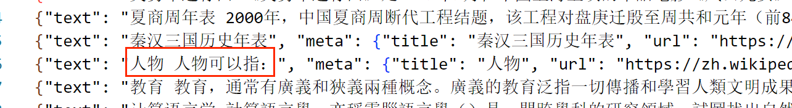
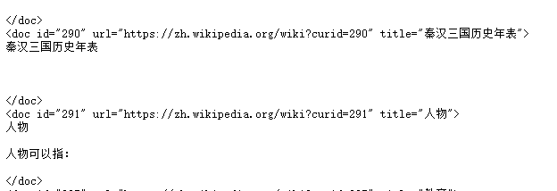

# 月之暗面大模型数据清洗说明文档

### 清洗策略：

先读取原始的文件内容，然后逐行处理每个文档。每遇到一个带有信息的 `<doc>` 标签，开始提取文档的元数据（如 `id`、`url` 和 `title`），并将该文档的内容缓存。

然后继续读取文档内容直到遇到结束标签 `</doc>`，当文档结束时，程序会对缓存的文档内容进行清洗。

清洗过程中，首先去除 HTML 标签，确保文档中只保留纯文本（这个我在做的时候看到有些\
这种内容，所以加上了）；接着统一处理文本中的空格和换行符，确保文本中的多余空格和换行符被替换为一个单一的空格，文本的开始和结束处也不会有额外的空白字符。

清洗后的文本会被保存到一个临时文件中，随后也会被转化为 JSON 格式保存到最终的输出文件中，每个文档的内容都以一行 JSON 记录的形式保存在文件里。此外，所有处理过程中的临时缓存和状态都会在文档处理结束后清空，以便处理下一个文档。

### 遇到的问题及解决方法：

1.我使用wikiextractor对数据进行解析，但是解析数据时遇到报错：ValueError: cannot find context for 'fork'

解决方式：在GitHub查找文档，发现这是windows电脑不兼容导致的，一开始我修改源文件中的“fork”为“spawn”觉得或许可以解决，后来发现会引发多进程问题，随后使用wsl2进行解决，在Linux环境中运行就没问题了

2.运行时文件过大，显存占用过多

解决方式："-b", "2048M",  设置分块大小为 2048MB

3.中间有很多无用空行，对于匹配有干扰

解决方式：因此删除空行和多余空格

4.中间还有一些零碎的问题，比如无法匹配doc结束符号，我才用新的逻辑，也就是先匹配doc开头，等到识别到doc结束符号再对中间文件进行处理，另外输出中间文件以供检查。

最后检查的时候，有一些数据看起来有缺漏，比如：

但是实际上内容就是这样：

